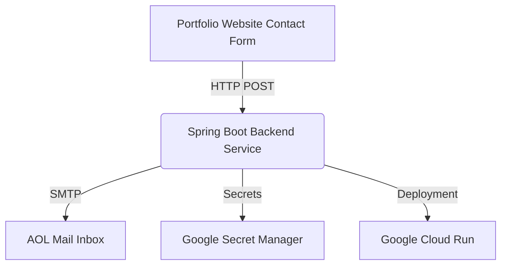

# 📬 Portfolio Contact Backend

A **Spring Boot microservice** deployed on **Google Cloud Run** that powers the contact form on my [portfolio website](https://carllalonde.com).  
It uses secure secret management and integrates with **AOL SMTP** to deliver submission forms directly to my email inbox.

---

## 🚀 Features
- 🌱 Built with **Spring Boot** for scalability and simplicity  
- ☁️ Deployed to **Google Cloud Run** with containerization support  
- 🔑 Uses **Google Secret Manager** for managing sensitive credentials  
- ✉️ Sends form submissions via **SMTP (AOL Mail)**  
- 🔐 Secured with environment variables and secret configs  
- ⚡ Lightweight, stateless microservice ready for production use  

---

## 🏗️ Architecture

---

## 📂 Project Structure
portfolio-contact/
├── src/main/java/com/carl/portfoliocontact
│   ├── controller/ContactController.java   # REST API endpoint
│   ├── dto/ContactRequest.java             # DTO for form submission
│   ├── service/EmailService.java           # Email sending logic
│   └── PortfolioContactApplication.java    # Spring Boot entry point
├── src/main/resources/
│   ├── application.properties              # Configuration
├── pom.xml                                 # Maven dependencies
└── README.md

---

##⚙️ Tech Stack
- Java 21
- Spring Boot
- Maven
- Google Cloud Run
- Google Secret Manager
- AOL SMTP
